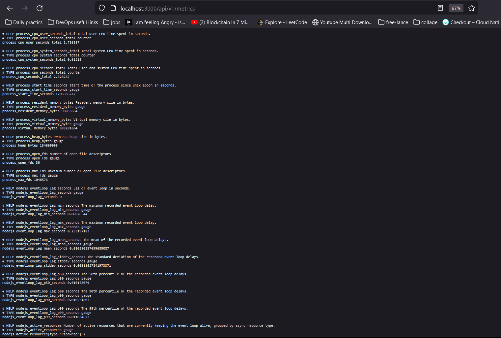
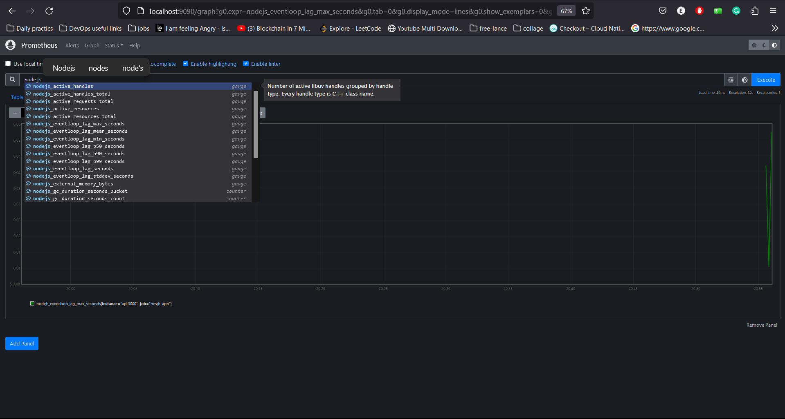

<p align="center">
  <a href="http://nestjs.com/" target="blank"></a>
</p>

[circleci-image]: https://img.shields.io/circleci/build/github/nestjs/nest/master?token=abc123def456
[circleci-url]: https://circleci.com/gh/nestjs/nest

  <h2 align="center">MicroService Club Api</h2>

# Description

This project is an vending_machine with authentiction , authorization. its a machine which you can signup in it as buyer or seller and do crud operation over the products

# The project uses the following technologies:

- Backend Framework: Node.js
- Language: TypeScript
- Server Framework: NestJS
- monitoring: Prometheus (cadvisor - nodejs promClient - node-exporter) and Grafana
- containerization: Docker
- CI/CD: Github Actions
- Database: PostgreSQL
- Authentication Middlewares: PassportJS
- Token Generation: JWT

# Getting Started

# Running the application

## Clone the repository

```bash
  git clone https://github.com/Waer1/vending_machine
  cd vending_machine
```

## Prerequisites

Before you can run this app, you need to have a PostgreSQL database set up. Create a database and add the database information to a `.env` file in the root of the project. Here's an example of what your `.env` file should look like:

```dotenv
NODE_ENV=development

# Postgres DB
DB_HOST=postgres
DB_PORT=5432
DB_USERNAME=postgres
DB_PASSWORD=postgres
DB_NAME=books-db

# PostGres Auth DB
POSTGRES_USER=postgres
POSTGRES_PASSWORD=postgres
POSTGRES_DB=books-db

# JWT
JWT_SECRET=secret
JWT_EXPIRATION=15d
BCRYPT_SALT=12

```

In this .env file:

## Required for the node application
- `DB_HOST` is the host of your PostgreSQL database
- `DB_PORT` is the port of your PostgreSQL database
- `DB_USERNAME` is the username of your PostgreSQL database
- `DB_PASSWORD` is the password of your PostgreSQL database
- `DB_NAME` is the name of your PostgreSQL database

### Required for the PostgreSQL database
- `POSTGRES_USER` is the username of your PostgreSQL database
- `POSTGRES_PASSWORD` is the password of your PostgreSQL database
- `POSTGRES_DB` is the name of your PostgreSQL database

### Required for the JWT & Authentication
- `JWT_SECRET` is the secret key for JWT
- `JWT_EXPIRATION` is the expiration time for JWT
- `BCRYPT_SALT` is the salt for bcrypt

#### IMPORTANT NOTE: before running the app you need to add the envs to the .env file in the root of the project

## Running with Docker using local code

You can run the app by pulling the Docker image from Docker Hub and then running the container.

```bash
  docker-compose up
```

it will build the image and run the container

now you can access the app on http://localhost:3000/ and have look at postman collection to test the api


## setup the monitoring and logging

you can setup the monitoring and logging by running the following command

```bash
  cd .\monitoring
  docker-compose -f docker-compose.yaml up
```

now you can access promtheus on http://localhost:9090/ and grafana on http://localhost:3010/ also test the nodejs metrics on http://localhost:3000/api/v1/metrics
with user name and password for grafana is waer and waer






## Testing the application

have a look at postman collection to test the api
